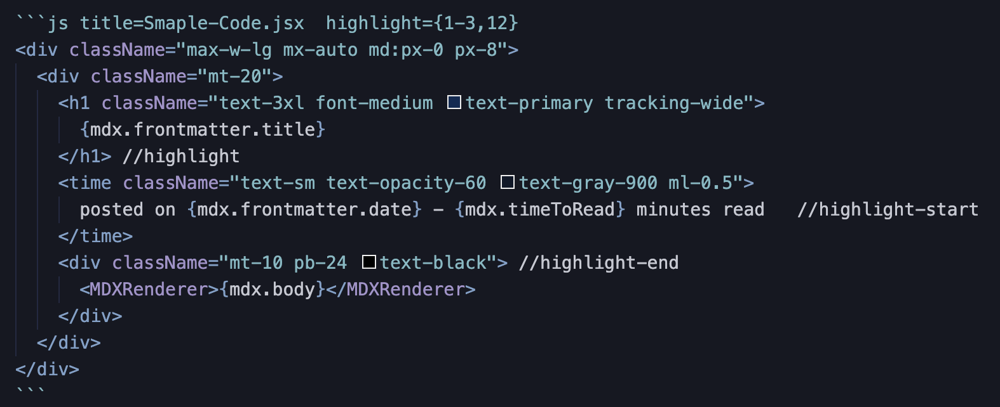

# react-mdx-prism-lighter とは

GatsbyJS の mdx 用コードハイライト補助関数を提供するパッケージです。

以下の画像はMDXファイルで、コードブロックを使用した例です。

画像1


画像1の1行目の `highlight={1-3,12}`では、ハイライトしたい行を数字で選択しています。
複数行の場合は`1-3`のように書くことで1行目、2行目、3行目をハイライトすることが可能です。

また、コードブロックの中でも、一行をハイライトする`//highlight`、複数行ハイライトの`//highlight-start`、`//highlight-end`を使用することで簡単にハイライトを導入できます。

以下のコードブロックは画像1のプレビュー画面となります。
```jsx title=Smaple-Code.jsx  highlight={1-3,12}
<div className="max-w-lg mx-auto md:px-0 px-8">
  <div className="mt-20">
    <h1 className="text-3xl font-medium text-primary tracking-wide">
      {mdx.frontmatter.title} 
    </h1> //highlight
    <time className="text-sm text-opacity-60 text-gray-900 ml-0.5">
      posted on {mdx.frontmatter.date} - {mdx.timeToRead} minutes read   //highlight-start
    </time>
    <div className="mt-10 pb-24 text-black"> //highlight-end
      <MDXRenderer>{mdx.body}</MDXRenderer>
    </div>
  </div>
</div>
```

# 使い方

MDXでカスタムコンポーネントを使用するには、`MDXProvider`を用いてコンポーネントを定義します。
GatsbyJSでは`wrapRootElement`を用いて、ルートエレメントをプロバイダーで囲むことができます。

カスタムなコードブロックを作成し、そこでこのパッケージの関数を使うには以下の手順が必要です。

<ul>
  <li>1. MDXProviderを用いたコンポーネントを作成</li>
  <li>2. そのコンポーネントの中で、カスタムコードブロックを定義</li>
  <li>3. そのコンポーネントをgatsby-ssr.js、gatsby-browser.jsの両方でインポートし、wrapRootElementでエクスポート</li>
</ul>

プロジェクトのルートに`Gatsby-Root.js`を作成する。

```jsx title=Gatsby-Root.js
import React from "react"
import { MDXProvider } from "@mdx-js/react"

import CodeBlock from "./src/components/Code" //カスタムコンポーネント

const BasicComponents = {
  pre: ({ children }) => {
    const child = children.props
    if (child.mdxType === "code") {
      return (
        <CodeBlock
          codeString={child.children.trim()}
          language={child.className.replace("language-", "")}
          title={child.title}
          highlight={child.highlight}
        />
      )
    } else return null
  },
}

const Root = ({ element }) => {
  return (
    <MDXProvider components={{ ...BasicComponents }}>
      {element}
    </MDXProvider>
  )
}

export default Root
```

カスタムコンポーネントを作成します。
例えば以下のような実装です。(tailwindcssを使用しています。)

```jsx title=./src/components/Code.jsx
import React, { useState } from "react"
import Highlight, { Prism } from "prism-react-renderer"
import nightOwl from "prism-react-renderer/themes/nightOwl"
import { CopyToClipboard } from "react-copy-to-clipboard"
import {
  LinesToHighlight,
  LinesNumberToHighlight,
} from "react-mdx-prism-lighter"

const HighlightClassName = " highlight-line"  //ハイライトの行に適用されるクラス名

const CodeBlock = ({ codeString, language, title, highlight }) => {
  const [value, setValues] = useState(["Copy", false])

  const CopyText = () => {　　//コピー機能
    setValues(["Copied", true])
    setTimeout(() => {
      setValues(["Copy", false])
    }, 5000)
  }

  return (
    <Highlight
      theme={nightOwl}
      Prism={Prism}
      code={codeString}
      language={language}>
      {({ style, tokens, getLineProps, getTokenProps }) => {
        return (
          <div className="mb-8">
            <div className="gatsby-title">
              {title && (
                <div className="py-3">
                  <p className="text-gray-900 text-sm px-3 select-none">
                    {title}
                  </p>
                </div>
              )}
            </div>

            <div className="relative" data-language={language}>
              <pre className="group  rounded-md" style={style}>
                <div className="px-0 pt-4 pb-4 overflow-auto">
                  <CopyToClipboard
                    text={codeString.replace(
                      /\/\/(highlight\s|(highlight-start)|(highlight-end))/g,
                      ""
                    )}
                    onCopy={CopyText}>
                    <button
                      className={`mx-4 focus:outline-none focus absolute top-2.5 right-0`}
                      disabled={value[1]}>
                      <p className="rounded-lg text-xs text-white text-opacity-60 bg-coolgray-700 bg-opacity-70 py-1 px-2.5 transition-all group-hover:opacity-100 opacity-0">
                        {value[0]}
                      </p>
                    </button>
                  </CopyToClipboard>
                  <div className="code_font text-sm sm:text-sm text-blue-900 tracking-normal px-6 float-left block min-w-full ">
                    {tokens.map((line, index) => {
                      const lineProps = getLineProps({ line, key: index })

                      if (LinesToHighlight(line)) {          //highlight-start
                        lineProps.className += HighlightClassName
                      }
                      if (LinesNumberToHighlight(highlight, index)) {
                        lineProps.className += HighlightClassName
                      }    //highlight-end

                      return (
                        <div {...lineProps}>
                          {line.map((token, key) => {
                            const tokenProps = getTokenProps({
                              token,
                              key: key,
                            })
                            return <span {...tokenProps} />
                          })}
                        </div>
                      )
                    })}
                  </div>
                </div>
              </pre>
            </div>
          </div>
        )
      }}
    </Highlight>
  )
}

export default CodeBlock
```

上の実装では`react-copy-to-clipboard`でコピー機能を、ハイライトそのものは`prism-react-renderer`を使用しています。
ハイライトしている箇所で,`react-mdx-prism-lighter`が提供する関数を使用しています。

最後に`gatsby-ssr.js`と`gatsby-browser.js`で`./Gatsby-Root`をインポートし、`wrapRootElement`としてエクスポートします。

```js
import Root from "./Gatsby-Root"

export const wrapRootElement = Root
```


#  react-mdx-prism-lighterの関数

提供される関数は２つです。

### LinesNumberToHighlight

指定した行番号をハイライトしてくれます。1行から複数行対応しています。

### LinesToHighlight

コード上で簡単にハイライトしたい行を指定できるものです。これも1行から複数行対応しています。

# このサイトのレポジトリ

<a href="https://github.com/NearCloser/react-mdx-prism-lighter_Example" target="_blank" rel="noopener noreferrer">
	react-mdx-prism-lighter_Example
</a>

# react-mdx-prism-lighterのレポジトリ

<a href="https://github.com/NearCloser/react-mdx-prism-lighter" target="_blank" rel="noopener noreferrer">
  react-mdx-prism-lighter
</a>

# ライセンス

MIT License
<!-- 
<LoremIpsum
p={4}
avgWordsPerSentence={10}
avgSentencesPerParagraph={10}
startWithLoremIpsum={false}
/> -->
